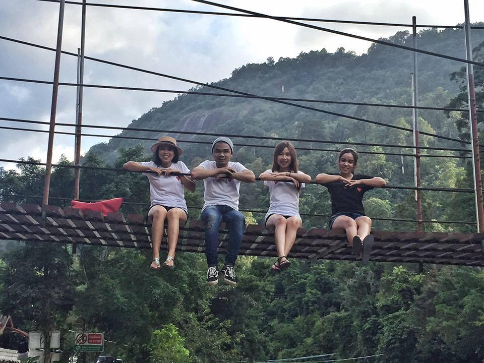
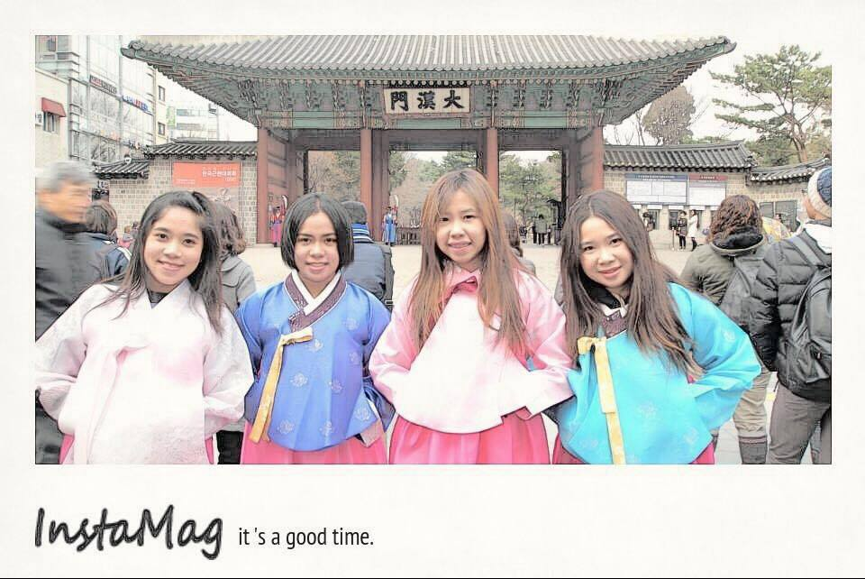
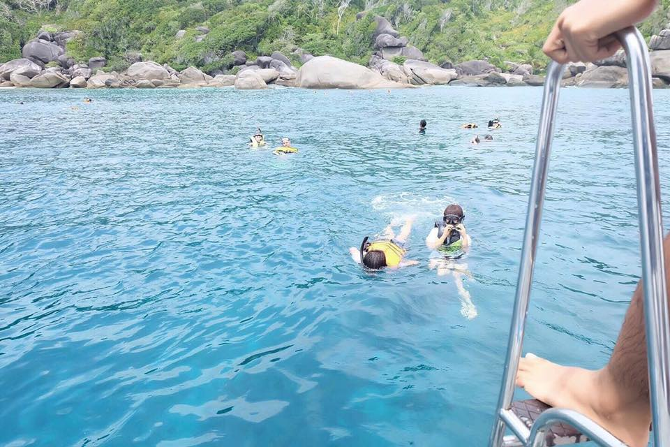
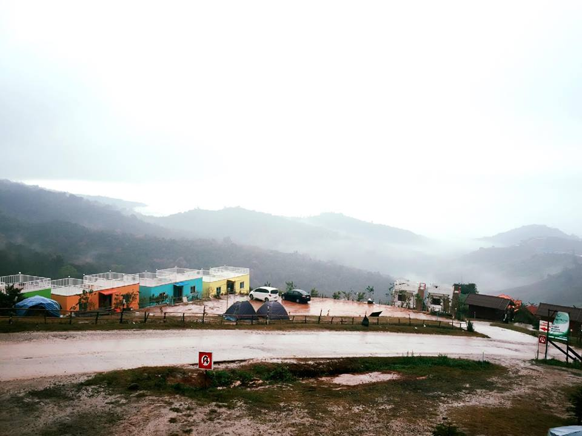
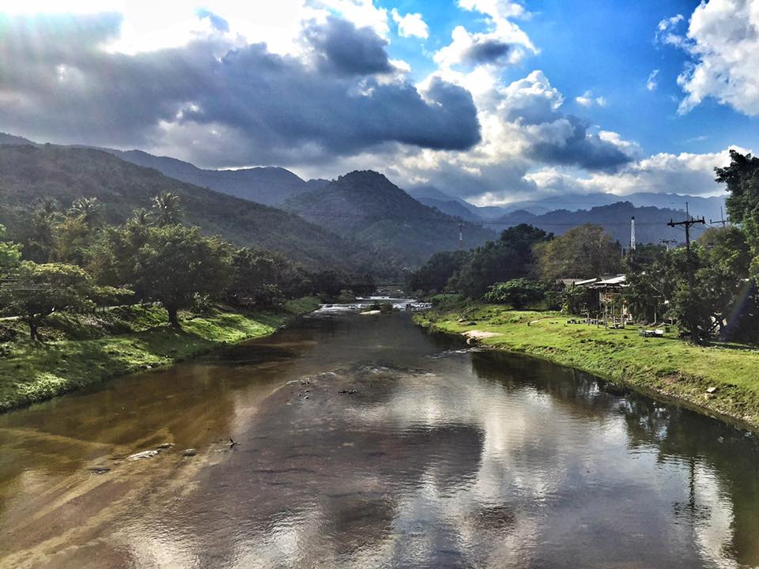
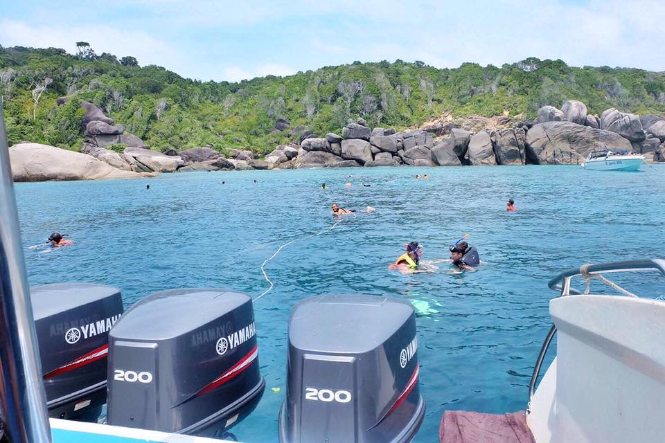
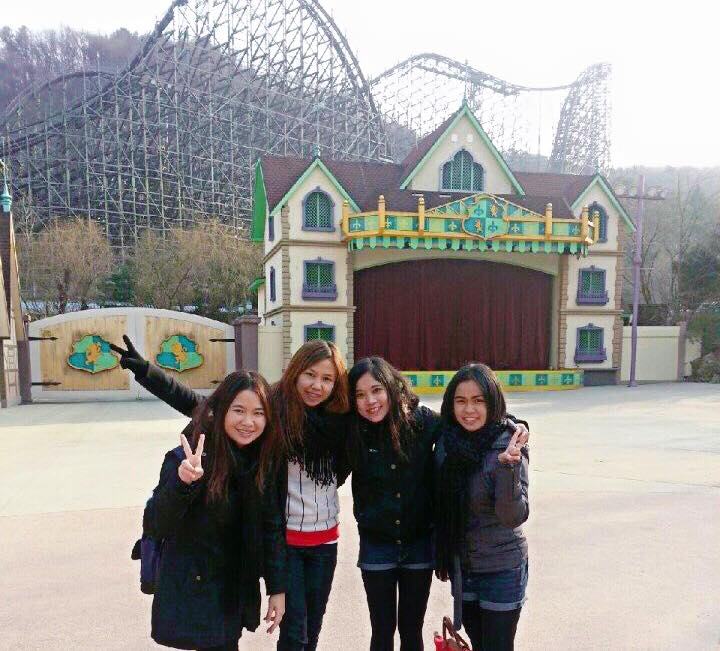

# aboutme2
<html>
<title>W3.CSS Template</title>
<meta charset="UTF-8">
<meta name="viewport" content="width=device-width, initial-scale=1">
<link rel="stylesheet" href="https://www.w3schools.com/w3css/4/w3.css">
<link rel='stylesheet' href='https://fonts.googleapis.com/css?family=Roboto'>
<link rel="stylesheet" href="https://cdnjs.cloudflare.com/ajax/libs/font-awesome/4.7.0/css/font-awesome.min.css">

<body class="w3-light-grey">

<!-- Page Container -->

  <!-- The Grid -->
  

  
    <!-- Left Column -->
    

    
      

        

          
          

            <h2>PIKAJU</h2>
          

        

        

          
<i class="fa fa-briefcase fa-fw w3-margin-right w3-large w3-text-red"></i>Student

          
<i class="fa fa-home fa-fw w3-margin-right w3-large w3-text-red"></i>Hatyai,Thailand

          
<i class="fa fa-envelope fa-fw w3-margin-right w3-large w3-text-red"></i>bukbik28@hotmail.com

          
<i class="fa fa-phone fa-fw w3-margin-right w3-large w3-text-red"></i>088-3928091

          

          
<b><i class="fa fa-asterisk fa-fw w3-margin-right w3-text-teal"></i>Skills</b>

          
Adobe Photoshop

          

            
40%

          

          
          
          
Illustrator

          

            
60%

          

          
Media

          

            
50%

          

           

          
<b><i class="fa fa-globe fa-fw w3-margin-right w3-text-teal"></i>Languages</b>

          
Thai

          

            

          

          
English

          

            

          

          
           
        

      
 

    <!-- End Left Column -->
    

    <!-- Right Column -->
    

    
      

	<h2 class="w3-text-black w3-padding-16"><i class="fa fa-certificate fa-fw w3-margin-right w3-xxlarge w3-text-blue"></i>Education</h2>
        

          <h5 class="w3-opacity"><b>High School</b></h5>
          <h6 class="w3-text-teal"><i class="fa fa-calendar fa-fw w3-margin-right"></i>2008 - 2015</h6>
          
          

        

        

          <h5 class="w3-opacity"><b>University</b></h5>
          <h6 class="w3-text-teal"><i class="fa fa-calendar fa-fw w3-margin-right"></i>2015 - current</h6>
          
          

        

        

      

        <h2>ABOUT ME</h2>
	<h3>Come to nkow me more!</h3>
	
My name's PIK.I'm 20 year old.

	<em>"I love to travel because it makes me happy. It make me relax.It was a very memorable experrience in life"</em> 
 	
	
	
      

    <!-- End Right Column -->
    

    
  <!-- End Grid -->
  

  
  <!-- End Page Container -->

<footer class="w3-container w3-light-blue w3-center w3-margin-top">
  
Find me on social media.

  <a href="https://www.facebook.com/paratee.suwanarat">Facebook</a>
  <a href="https://www.instagram.com/pikapikaju/">Instargram</a>
 
</footer>

